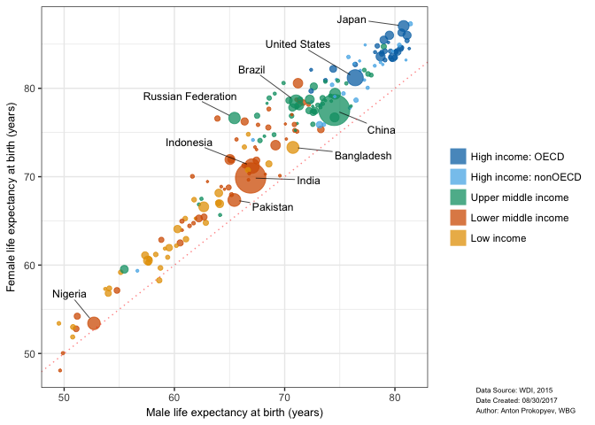

# DECDG: Data Analysis Exercise
Anton Prokopyev  
September 4, 2017  
## How Life Expectancy Differs Between Wealthy and Developing Countries

Here at The World Bank we are interested in using open data to share insights about economic development. In this report we take a quick look at the how life expectancy differs between rich and poor countries, and display some of the new interactive data discovery tools we have been working on.

#### Gender differences in life expectancy at birth
Using the 2015 WDI indicators as the most recent full snapshot of world economy.

<!-- -->

The red dotted line shows an ideal situation of gender parity, where males and females would have equal life expectancy. It shows a situation where members of both genders of a given country would be expected to live for the same amount of time, e.g. 70 years for males (x-axis) and females (y-axis).

The point size differs to reflect differences in populations of these countries. 

We extracted several insights from the data and its visualization:

- Women do live longer than men everywhere around the world except one exception–Swaziland–which suffers from the lowest life expectancy in the world. The trend with female life expectancy dropping below the male indicator hit a low in 2004, and is potentially related with HIV situation in the country. Explore the time trends further in this [line graph](https://data.worldbank.org/indicator/SP.DYN.LE00.FE.IN?locations=SZ). 

- Low and lower middle income countries are grouped in the lower left quadrant, which proves that people in developing states live shorter than in rich countries. Surprisingly though, the gender gap in life expectancy in developing countries is smaller than that of wealthier countries. The contrast is the starkest in Russia, an upper middle income country where the difference reaches 11+ years, to be surpassed by Syria. In simple terms, if you are poor you will live a short life in any case. Being born female would not provide you with a major extension of the length of your life.

- It is unusual to see an upper middle income and a high income country among low income countries at [55;60] mark. To explore more cases like this we have build an interactive version of the chart. In this case the two countries with abnormally low life expectancies for their income level are South Africa and Equatorial Guinea. The latter is a curious example of a resource curse. It is classified as a high income country due to high GNI per capita caused by presence of oil resources (read more about groupings of economies [here](https://datahelpdesk.worldbank.org/knowledgebase/articles/378831-why-use-gni-per-capita-to-classify-economies-into). 

To explore this and other cases use zoom and panning in the chart below.

<!--html_preserve-->

<!--/html_preserve-->
   

This information provides important context for anyone working in the economic development industry. Whether an economist or a policymaker, both can put this information to use in the context of their work. Moving forward with this topic, we recommend augmenting this anlysis by looking at life expectancy at age 65, similar to this [paper](http://www.longevitypanel.co.uk/_files/life-expectancy-by-gender.pdf).

The World Bank staff are here to facilitate the access to this information. In future blog posts, we will be updating this dataviz catalogue with new products. If you are interested in exploring development data and downloading it for further analysis, visit [World Bank Data](data.worldbank.org) to learn more.  

Reproducible research: download [RMarkdown file](https://prokopyev.github.io/wbg-projects/decdg_01/decdg_data_analysis_v1.Rmd).  
